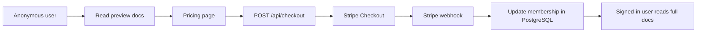
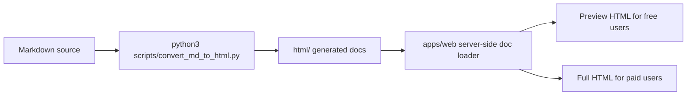

# 付费文档网站架构方案

## 目标

将当前仓库里的文档升级为“前几章可试读、付费后解锁全文”的真实网站，而不是前端假遮罩。

## 技术栈

- Web: `Next.js App Router`
- Auth: `NextAuth`
- DB: `PostgreSQL + Prisma`
- Billing: `Stripe Checkout + Webhook`
- Content source: 仓库根目录 `html/`

## 内容访问模型

1. 首页公开
2. `docs/` 规范页公开
3. 各模块总览页公开
4. 每个主模块再开放前 `2` 篇章节作为试读
5. 其他章节只有已付费用户能拿到全文

关键点：
- 不是把完整 HTML 发给前端再遮挡
- 而是服务端按权限决定返回 `previewHtml` 还是 `bodyHtml`

## 数据模型

核心表：

- `User`
- `Account`
- `Session`
- `Purchase`
- `WebhookEvent`

用户权限字段：

- `membershipPlan`
- `membershipStatus`
- `membershipExpiresAt`
- `stripeCustomerId`
- `stripeSubscriptionId`

## 支付闭环

## 内容流

## 代码骨架位置

- 网站应用：[apps/web](/Users/yunxuanhan/Documents/workspace/ai/LLM-Core/apps/web)
- Prisma 模型：[apps/web/prisma/schema.prisma](/Users/yunxuanhan/Documents/workspace/ai/LLM-Core/apps/web/prisma/schema.prisma)
- 文档访问控制：[apps/web/src/lib/docs.ts](/Users/yunxuanhan/Documents/workspace/ai/LLM-Core/apps/web/src/lib/docs.ts)
- 支付逻辑：[apps/web/src/lib/billing.ts](/Users/yunxuanhan/Documents/workspace/ai/LLM-Core/apps/web/src/lib/billing.ts)
- 登录配置：[apps/web/src/lib/auth.ts](/Users/yunxuanhan/Documents/workspace/ai/LLM-Core/apps/web/src/lib/auth.ts)

## 当前状态

已完成：

- 架构设计
- 目录骨架
- Next.js 路由骨架
- Stripe webhook/checkout 路由骨架
- Prisma schema
- 服务端试读/全文分流逻辑

未完成：

- 真实 OAuth 凭据接入
- Stripe 价格与 webhook 配置
- 数据库初始化
- 生产部署
