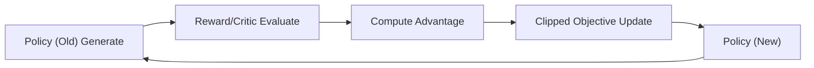

# PPO (Proximal Policy Optimization) 强化学习对齐

> [!TIP]
> **一句话通俗理解**：PPO 用裁剪目标限制新旧策略偏移，在可学习性与训练稳定性之间取得工程上最实用的平衡。

## 定位与分类

- **阶段**：后训练（Post-training）之 RLHF 对齐阶段。
- **类型**：强化学习（Policy Gradient + KL Constraint）。

## 关键公式

### 1. 关键公式：PPO 剪切目标函数 (Clipped Objective)

PPO 的核心在于如何在提升性能的同时，限制策略更新的幅度，确保训练稳健。其核心目标函数为：

$$L^{CLIP}(\theta) = \mathbb{E}_t \left[ \min\left( r_t(\theta)\hat{A}_t, \mathrm{clip}(r_t(\theta), 1-\epsilon, 1+\epsilon)\hat{A}_t \right) \right]$$

**公式拆解与理解：**

- **$r_t(\theta)$ (概率比例)**：当前新策略与旧策略在特定动作上的概率比值。
- **$\hat{A}_t$ (Advantage/优势)** ：由 Critic 辅助计算。告诉模型当前的动作比平均水平好多少。
- **$\mathrm{clip}(\dots, 1-\epsilon, 1+\epsilon)$**：剪切机制。如果新旧策略差异超过 $\epsilon$ （通常为 0.1 或 0.2），则强制将比例截断。
- **$\min$ 函数**：取两者的最小值。这是一个保守策略：即使 Advantage 非常大，我们也不希望一次性更新太猛；如果更新方向错了， $\min$ 会让模型快速回调。

### 2. LLM 中的特殊约束：KL 惩罚

在 LLM 的 PPO 流程中，为了防止模型为了刷分而变成“复读机”或失去逻辑，会在奖励函数中加入 KL 散度项：

$$\mathrm{Reward}_{total} = \mathrm{Reward}_{RM} - \beta \cdot D_{KL}(\pi_\theta || \pi_{ref})$$

- **意义**：在追求高分（Reward）的同时，惩罚那些偏离原始 SFT 模型（Reference）太远的行为。它就像一条“风筝线”，拉住模型不让其产生严重的策略崩坏。

## 图文速览（参考 llm_interview_note）


图示解读：PPO 的关键是“采样-评估-裁剪更新”闭环，避免策略一步更新过猛导致训练崩溃。



## 核心架构：四大角色

PPO 训练背后涉及四个关键模型的协作：

| 角色 | 模型名称 | 职责描述 | 状态 |
| :--- | :--- | :--- | :--- |
| **Actor** | 策略模型 (Policy) | 核心优化对象。负责根据指令生成回复，目标是获得最高奖励。 | **动态更新** |
| **Reference** | 参考模型 (Ref) | 冻结的 SFT 原型。计算 KL 散度，防止 Actor 为了刷分而导致语言逻辑崩坏。 | **完全冻结** |
| **Reward** | 奖励模型 (RM) | 裁判。根据学到的人类价值观偏好，为 Actor 的生成结果打分。 | **完全冻结** |
| **Critic** | 价值模型 (Value) | 会计。预测当前状态的期望得分，辅助计算“超额回报（Advantage）”。 | **动态更新** |

## 数据逻辑：Prompt-only

在 PPO 阶段，数据集的使用逻辑与 SFT 有本质区别：

- **Instruction (问题) 是核心**：它是产生行为的“启动器（Prompt）”。PPO 只需要指令来驱动模型在线生成答案。
- **Output (标签) 是弱依赖**：在 PPO 循环中，模型不看数据集里的 Output 学习，而是看奖励模型（RM）的实时打分。Output 在此处多作为格式兼容或评估参考。
- **本质转向**：从 SFT 的“背书式学习（标签驱动）”转向了 PPO 的“实践式学习（反馈驱动）”。

## 深度辨析：Reward vs. Critic

这是理解 PPO 算法稳定性的关键：

- **Reward Model (裁判)**：定性。决定了“什么是好”。它输出的是**实际得分**。
- **Critic Model (会计)**：定量。决定了“好出多少”。它输出的是**期望得分**。
- **Advantage (优势/超额回报)**：由 `实际得分 - 期望得分` 计算得出。
  - 若 `Advantage > 0`：表示这次表现超出了平均水平，强化该行为。
  - 若 `Advantage < 0`：表示这次表现低于平均水平，即使分数很高也要反思。
  > **意义**：Critic 抹平了题目难度差异，让模型只关注纯粹的技术进步。

## 关键训练配置

| 参数 | 典型值 | 原理解读 |
| :--- | :--- | :--- |
| `learning_rate` | `1e-6` | 极低学习率，确保强化学习这种极不稳定的过程能平稳收敛。 |
| `ppo_epochs` | `4` | 对同一批采样数据重复学习的次数，提高样本利用率。 |
| `ppo_target` | `6.0` | KL 目标值。动态调整惩罚强度，确保模型不脱离人类语言分布。 |
| `ppo_buffer_size` | `1` | 经验回放池大小，在资源受限时控制单次更新的数据量。 |

## 🛠️ 工程实战：PPO/RLHF 训练

### 方式一：LLaMA Factory

**数据格式**（PPO 仅需 Prompt，不需要标准答案）：

```json
[
  {"instruction": "请写一首关于秋天的五言绝句。", "input": ""},
  {"instruction": "如何优化 Python 中的内存使用？", "input": ""}
]
```

**训练配置 YAML（需先训练 Reward Model）**：

```yaml
### Step 1: 训练奖励模型 (reward_model.yaml)
model_name_or_path: Qwen/Qwen2.5-7B
stage: rm                               # 奖励模型训练
finetuning_type: lora
dataset: my_preference_data              # 偏好对数据（同 DPO 格式）
template: qwen
output_dir: saves/qwen2.5-7b/lora/reward
```

```yaml
### Step 2: PPO 训练 (ppo_train.yaml)
model_name_or_path: Qwen/Qwen2.5-7B
stage: ppo                               # 关键：设为 ppo
do_train: true
finetuning_type: lora
reward_model: saves/qwen2.5-7b/lora/reward   # 指向 RM checkpoint

### PPO 超参
ppo_epochs: 4                            # 每批数据重复训练次数
ppo_target: 6.0                          # KL 目标值

### LoRA
lora_rank: 64
lora_target: all

### 数据（Prompt-only）
dataset: my_ppo_prompts
template: qwen

### 训练
per_device_train_batch_size: 1
gradient_accumulation_steps: 8
learning_rate: 1.0e-6                    # 极低学习率，防止 RL 发散
bf16: true
output_dir: saves/qwen2.5-7b/lora/ppo
```

```python
# 关键步骤代码（示意）
state = init_state()
for step in range(num_steps):
    state = step_update(state)
metrics = evaluate(state)
```

**可视化**：默认输出至 `output/ppo_metrics`。建议阅读顺序：`summary.json` → `training_curves.png` → `training_metrics.csv`。

---
## 定义与目标

- **定义**：PPO (Proximal Policy Optimization) 强化学习对齐 属于“后训练对齐模块，聚焦 SFT、偏好优化与 RLHF 系列方法。”范畴。
- **目标**：在能力、可控性与安全性之间建立可迭代的对齐训练闭环。
## 适用场景与边界

- **适用场景**：用于构建指令跟随、偏好对齐与奖励驱动优化流程。
- **不适用场景**：不适用于缺少高质量偏好数据或评测体系的直接落地。
- **使用边界**：对齐收益受数据质量、奖励建模与 KL 约束策略影响明显。

## 关键步骤

1. 构建对齐数据与偏好信号（指令数据/偏好对/奖励模型）。
2. 在约束条件下优化策略，使输出更符合人类偏好。
3. 联合有用性、安全性与稳定性指标进行迭代评估。
## 关键步骤代码（纯文档示例）

```python
# 关键流程示意（与具体工程实现解耦）
state = init_state()
for step in range(num_steps):
    state = step_update(state)
metrics = evaluate(state)
```

## 工程实现要点

- 优先保证数据质量与评测一致性，再放大训练规模。
- 在线/离线对齐需分别监控稳定性、奖励漂移与过优化风险。
- 保持参考模型与训练模型版本可追踪，便于回溯问题。

## 常见错误与排查

- **症状**：奖励升高但人工体验下降。  
  **原因**：奖励黑客或偏好模型偏差导致目标错位。  
  **解决**：引入人工抽检与多指标约束，限制单一奖励驱动。
- **症状**：训练不稳定或发散。  
  **原因**：学习率/KL 系数/批量配置不匹配。  
  **解决**：缩小超参搜索范围并分阶段增大训练强度。

## 与相近方法对比

| 方法 | 优点 | 局限 | 适用场景 |
| --- | --- | --- | --- |
| 本文主题方法 | 紧贴本节问题定义 | 依赖数据与实现质量 | 适合结构化评测与迭代优化 |
| 对比方法A | 上手成本更低 | 能力上限可能受限 | 快速原型与基线对照 |
| 对比方法B | 上限潜力更高 | 调参与资源成本更高 | 高要求生产或复杂任务场景 |

## 参考资料

- [InstructGPT](https://arxiv.org/abs/2203.02155)
- [Direct Preference Optimization](https://arxiv.org/abs/2305.18290)
