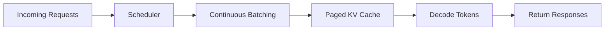

# 推理优化 (Inference Optimization)

> [!TIP]
> **一句话通俗理解**：推理优化围绕 KV Cache、批调度与算子融合，目标是在延迟、吞吐与成本之间找到最优点。

## 定位与分类

- **阶段**：推理与部署 (Deployment)。
- **类型**：吞吐与延迟优化。
- **作用**：随着 LLM 参数量 and 用户并发的增加，如何通过工程手段降低首字延迟 (TTFT) and 提升生成吞吐是技术解析核心。

## 核心概念：KV Cache

### 痛点

自回归生成中，每个新 Token 都要重新计算之前所有 Token 的表示，导致重复计算。

### 策略

将前向计算中的 Key 和 Value 缓存下来，后续 Token 仅需与缓存进行计算。

- **显存占用公式**：
  $$\mathrm{Mem}_{KV} = 2 \times \mathrm{layers} \times \mathrm{heads} \times \mathrm{hidden\_dim} \times \mathrm{seq\_len} \times \mathrm{precision\_bytes}$$

- **技术解析点**：Llama 7B (fp16) 处理 1024 长度约占用 0.5GB 显存。

## 图文速览（参考 llm_interview_note）


图示解读：连续批处理会在请求完成后立即补入新请求，比静态批处理更能减少 GPU 空转。



## 推理框架 (Inference Frameworks)

| 框架 | 核心技术点 | 场景优势 |
| :--- | :--- | :--- |
| **vLLM** | **PagedAttention**：解决 KV Cache 显存碎片化，提升 Batch 吞吐 2-10x。 | 高并发、云端生产环境。 |
| **sglang** | **RadixAttention**：前缀缓存与端到端编译优化。 | 复杂指令流、长对话缓存共享场景。 |
| **TensorRT-LLM** | 深度算子融合 (In-flight Batching) 与硬件极致优化。 | NVIDIA 硬件环境下的极致低延迟。 |

## 性能调优 (Performance Tuning)

### 1. GPU 性能优化

- **算子融合 (Operator Fusion)**：减少 HBM (显存) 与 SRAM (计算核) 间的数据搬移。
- **Flash Attention**：通过分块计算优化 IO 瓶颈。
- **并行策略**：流水线并行 (PP)、张量并行 (TP) 与 数据并行 (DP) 的协同。

### 2. CPU 性能优化

- **模型量化**：使用 **GGUF** 格式进行 4-bit 量化，显著降低显存带宽压力。
- **SIMD 指令集**：利用 AVX-512 等向量化指令加速矩阵乘法。

## 量化深度分析 (Quantization)

- **后量化 (PTQ)**：在训练完成后直接对权重/激活进行量化（如 GPTQ, AWQ）。
- **量化感知训练 (QAT)**：在训练中模拟量化误差，通常精度损失最小。
- **精度对标**：**定点量化 (INT8/INT4)** 与 **浮点量化 (FP8)** 的数值稳定性权衡。

## 技术核心解析

1. **如何降低首字延迟 (TTFT)？**
   - 使用 Flash Attention。
   - Prefill 阶段并行化计算、投机采样验证。
2. **显存足够时，如何提升吞吐？**
   - 使用 Continuous Batching (vLLM) 动态调度。
   - 增加并发请求量，利用 PagedAttention 提升利用率。
3. **Pined Memory 与性能？**
   - 锁页内存，消除 CPU 数据到 GPU 的驱动拷贝损耗，提升搬运速度。

---

## 🛠️ 工程实战

### vLLM 部署（生产推荐）

```bash
# 安装
pip install vllm

# 启动 OpenAI 兼容 API 服务
vllm serve Qwen/Qwen2.5-7B \
    --tensor-parallel-size 2 \
    --max-model-len 8192 \
    --gpu-memory-utilization 0.9 \
    --port 8000
```

```python
# Python 客户端调用
from openai import OpenAI

client = OpenAI(base_url="http://localhost:8000/v1", api_key="EMPTY")
response = client.chat.completions.create(
    model="Qwen/Qwen2.5-7B",
    messages=[{"role": "user", "content": "什么是 PagedAttention？"}],
    max_tokens=512,
    temperature=0.7,
)
print(response.choices[0].message.content)
```

### vLLM 离线批量推理

```python
from vllm import LLM, SamplingParams

llm = LLM(model="Qwen/Qwen2.5-7B", tensor_parallel_size=2)
sampling_params = SamplingParams(temperature=0.7, top_p=0.9, max_tokens=512)

prompts = ["解释 KV Cache 的原理", "PagedAttention 如何减少显存碎片？"]
outputs = llm.generate(prompts, sampling_params)

for output in outputs:
    print(f"Prompt: {output.prompt}")
    print(f"Response: {output.outputs[0].text}\n")
```

### SGLang 部署（复杂任务推荐）

```bash
# 安装
pip install sglang[all]

# 启动服务（自动启用 RadixAttention 前缀缓存）
python -m sglang.launch_server \
    --model-path Qwen/Qwen2.5-7B \
    --tp 2 \
    --port 30000
```

### 量化部署（GPTQ / AWQ）

```bash
# 使用 AutoGPTQ 量化
pip install auto-gptq

# 直接加载社区已量化的模型
vllm serve Qwen/Qwen2.5-7B-Instruct-GPTQ-Int4 \
    --quantization gptq \
    --max-model-len 8192 \
    --port 8000
```

```python
# 或使用 transformers 加载量化模型
from transformers import AutoModelForCausalLM, AutoTokenizer

model = AutoModelForCausalLM.from_pretrained(
    "Qwen/Qwen2.5-7B-Instruct-GPTQ-Int4",
    device_map="auto",
)
# 7B INT4 量化后仅需 ~4GB VRAM
```

### 性能基准测试

```bash
# vLLM 内置 benchmark 工具
python -m vllm.entrypoints.openai.api_server &

# 使用 wrk 或内置工具压测
python -m vllm.benchmark_serving \
    --model Qwen/Qwen2.5-7B \
    --num-prompts 1000 \
    --request-rate 10
```

---
## 定义与目标

- **定义**：推理优化 (Inference Optimization) 属于“工程优化模块，关注训练与推理系统的吞吐、显存和稳定性。”范畴。
- **目标**：在既定硬件预算下实现更高性能与更稳定的端到端流程。
## 适用场景与边界

- **适用场景**：用于分布式训练、推理加速与系统瓶颈定位。
- **不适用场景**：不适用于缺少性能观测指标的“盲调”优化。
- **使用边界**：优化结论受硬件拓扑、并行策略与请求分布影响。

## 关键步骤

1. 建立基线指标（吞吐、延迟、显存、成本）。
2. 按算子、精度、并行与调度路径分层优化。
3. 在目标流量下回归测试性能与稳定性。
## 关键公式（逻辑表达）

`GlobalBatch = micro_batch * grad_accum * data_parallel`

符号说明：
- `micro_batch`：单卡每步样本数。
- `grad_accum`：梯度累积步数。
- `data_parallel`：数据并行副本数。
## 关键步骤代码（纯文档示例）

```python
# 关键流程示意（与具体工程实现解耦）
state = init_state()
for step in range(num_steps):
    state = step_update(state)
metrics = evaluate(state)
```

## 工程实现要点

- 先建立基准（TTFT/吞吐/显存），再做分项优化。
- 并行策略、精度策略与算子优化要协同评估。
- 保留压测脚本与配置快照，确保优化可复验。

## 常见错误与排查

- **症状**：吞吐提升但延迟恶化。  
  **原因**：批处理策略偏向吞吐，牺牲了单请求时延。  
  **解决**：按业务目标拆分延迟/吞吐档位并分别调参。
- **症状**：多机训练效率低。  
  **原因**：通信开销或并行划分与硬件拓扑不匹配。  
  **解决**：重排并行维度并用 profiler 定位通信热点。

## 与相近方法对比

| 方法 | 优点 | 局限 | 适用场景 |
| --- | --- | --- | --- |
| 本文主题方法 | 紧贴本节问题定义 | 依赖数据与实现质量 | 适合结构化评测与迭代优化 |
| 对比方法A | 上手成本更低 | 能力上限可能受限 | 快速原型与基线对照 |
| 对比方法B | 上限潜力更高 | 调参与资源成本更高 | 高要求生产或复杂任务场景 |

## 参考资料

- [Megatron-LM](https://github.com/NVIDIA/Megatron-LM)
- [DeepSpeed](https://www.deepspeed.ai/)
